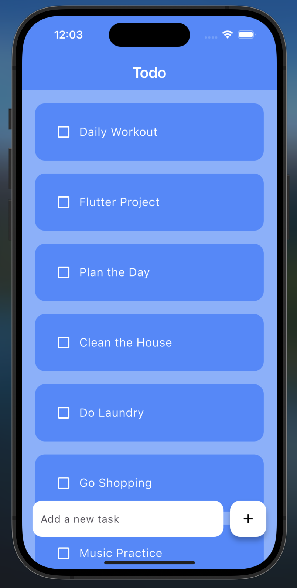

# Todo App

A clean, simple todo list application built with Flutter that helps you stay organized by managing your daily tasks.



<!-- Note: Replace with an actual screenshot URL when available -->

## Features

- Create and manage todo items
- Mark tasks as completed with a checkbox
- Clean, modern UI with a blue color scheme
- Easy-to-use interface with a floating action button to add new tasks

## Getting Started

### Prerequisites

- [Flutter](https://docs.flutter.dev/get-started/install) (2.0.0 or higher)
- [Dart](https://dart.dev/get-dart) (2.12.0 or higher)
- An IDE (VS Code, Android Studio, or IntelliJ)

### Installation

1. Clone this repository

```bash
git clone https://github.com/josueahadi/todo.git
```

2. Navigate to the project directory

```bash
cd todo
```

3. Install dependencies

```bash
flutter pub get
```

### Running the App

Run the app in debug mode:

```bash
flutter run
```

For a specific device:

```bash
flutter devices
flutter run -d <device_id>
```

## Project Structure

- `lib/main.dart` - Entry point of the application
- `lib/screens/home.dart` - Main screen with todo list
- `lib/utils/todo_list.dart` - Reusable widget for todo items

## How to Use

1. Launch the app
2. View your existing todo items
3. Check/uncheck items to mark them as complete/incomplete
4. Enter text in the field at the bottom
5. Tap the + button to add a new task

## Future Enhancements

- Persistent storage using shared preferences or a database
- Categorization of tasks
- Due dates and reminders
- Dark mode theme
- Swipe to delete functionality

## Contributing

Contributions are welcome! Please feel free to submit a Pull Request.

1. Fork the repository
2. Create your feature branch (`git checkout -b feature/amazing-feature`)
3. Commit your changes (`git commit -m 'Add some amazing feature'`)
4. Push to the branch (`git push origin feature/amazing-feature`)
5. Open a Pull Request

## License

This project is licensed under the MIT License - see the LICENSE file for details.

## Acknowledgements

- Flutter team for the amazing framework
- All open-source contributors

---

**Note:** This is a learning project created to demonstrate Flutter capabilities and best practices for mobile app development.
